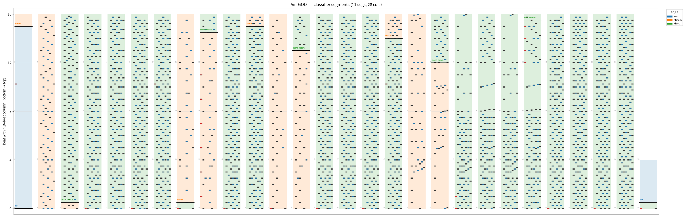
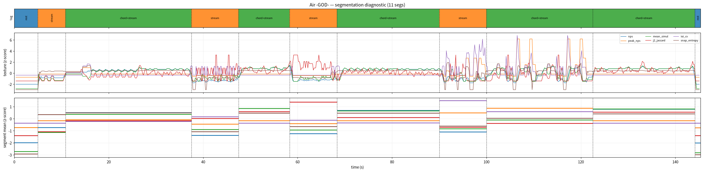

# BMS Pattern Classifier

Splits a **7K + scratch** BMS chart into segments by *texture* (how dense/repetitive
it plays), then tags each segment with the pattern types it contains — `stream`,
`jack`, `trill`, `chord`, `denim`, `stair`, `long`, `scratch`, `soflan`, `rest`,
`mix`. Tags are **multi-label**: one segment can be `chord+stream`.

Pure heuristics on interpretable features — no training, no model file. Only 7K
single-play is supported; other keymodes are detected and skipped, not mis-tagged.

## Install

Requires **Python 3.10+**.

```bash
python -m venv .venv && .venv/bin/pip install -r requirements.txt
```

`numpy` + `ruptures` (segmentation) are all the CLI needs; `matplotlib` is only for
the `--png` / `--timeline` images. `main.py` re-execs itself under `.venv`, so
`python main.py ...` works without activating the venv first.

## Usage

```bash
python main.py <chart.bms> [more charts...]   # segments + tags, as text
python main.py <chart.bms> --json             # boundaries + tags + texture, as JSON
python main.py <chart.bms> --png              # chart render with segment/tag overlay
python main.py <chart.bms> --timeline         # segmentation diagnostic (texture curves)
```

`.bms` / `.bme` both work. Batch multiple files in one call; a broken file is logged
and skipped, never crashing the batch.

### Programmatic use

The same pipeline is one function — the CLI is just a wrapper around it:

```python
from src.tag import tag_chart

r = tag_chart("path/to/chart.bme")   # same dict the --json output prints
r["keymode"]                         # '7k' | 'dp/multi' | 'other' | 'empty'
for s in r["segments"]:
    print(s["t0"], s["t1"], s["tags"])
```

Non-7K charts come back with `keymode != "7k"` and no segments (never mis-tagged).

## Tags

| Tag | Means | Fires when (roughly) |
|-----|-------|----------------------|
| `rest` | Too sparse to read | keyboard density < 2.5 notes/s and nothing else fires |
| `stream` | Dense single-note flow | ≥ 6 notes/s with no dominant shape |
| `jack` | Same key repeated on back-to-back rows | ≥ 25% of notes repeat the previous row's column |
| `trill` | Sustained two-note alternation (A-B-A-B) | run-gated alternation covers ≥ 15% of single notes |
| `stair` | Notes walking monotonically across columns | ≥ 16% of single notes sit in an up/down run of ≥ 3 |
| `chord` | Simultaneous notes (jumps/hands) | mean notes-per-row ≥ 1.8 |
| `denim` | 2-periodic overlapping chords (not a jack) | lag-2 similarity ≥ 0.55 **and** hand-span overlap ≥ 0.50 **and** chordy **and** not a jack |
| `long` | Long notes / LN-jacks | LN active ≥ 45% of the segment, or many taps under held LNs |
| `scratch` | Fast continuous scratching | ≥ 3.5 scratches/s (a slow backbeat scratch does not count) |
| `soflan` | Tempo change / stops | ≥ 15% of the segment is off the main BPM, or STOP freezes ≥ 5% |
| `mix` | Dense but no single pattern dominates | fallback when the segment clears `rest` but matches nothing specific |

`scratch`, `soflan`, and `long` are **orthogonal channels** — density-independent, so
they can tag even an otherwise-`rest` segment (a slow soflan intro, a lone sustained LN).

## How it works

```
.bms ─► parse ─► sliding-window features ─► PELT segmentation ─► per-segment ─► threshold ─► tags
        notes    (2-beat win, 0.5 hop)      on texture axes      mean vector    classify
```

**1. Parse** (`src/parser.py`) — reads notes as `(beat, wall-clock time, column)` with a
beat↔time tempo map plus raw BPM/STOP events. Columns `0–6` are keys, `7` is scratch;
scratch is kept out of the keyboard-pattern features and handled on its own channel.

**2. Measure** (`src/features.py`) — for each 2-beat window (hopped every 0.5 beat) it
computes one interpretable feature vector. The features the tagger reads:

- **Density**: `nps` (keyboard notes/sec — scratch excluded), `peak_nps`, `mean_simul` (notes per row = chord thickness)
- **Sequence** (single-note rows): `jack_ratio` (shared column with adjacent row), `trill_ratio` (sustained A-B-A-B, *run-gated* so zigzag stairs and random streams don't leak in), `stair_ratio` (monotone run of ≥ 3)
- **Chord shape**: `j2_jaccard` (lag-2 key-set self-similarity → 2-periodicity), `span_overlap` (adjacent hand spans intersect)
- **BMS channels**: `scratch_nps`, `ln_coverage` / `ln_active_tap_ratio`, `bpm_off_main` (fraction off the main tempo) / `stop_time_frac`

**3. Segment** (`src/segment.py`) — boundaries are placed on **texture change only** —
density (`nps`, `peak_nps`, `mean_simul`) and repetition degree (`j2_jaccard`, `ioi_cv`,
`snap_entropy`) — *not* pattern shape (that's the tagger's job; segmenting on it too would
chop a steady passage every time the hand-shape drifts). Features are z-scored per chart,
then PELT (`l2`) changepoint detection auto-selects the boundaries. Granularity is one
knob, `BMS_PEN_MULT` (default `3.0`, higher = coarser).

**4. Tag** (`src/tagger.py`) — each segment is the **mean of its windows' features in raw
units**. The classifier applies **absolute thresholds** (in `THR`) to that vector and emits
the tag set. Absolute (not corpus-relative) bars matter: relative z-scoring inflates
rare-but-above-average features (a jumpstream would drift toward the `denim` region even
though real denim needs `j2 ≥ 0.55`).

Features and segments are cached to `.cache/` (one pickle per chart × window × hop ×
feature-version); delete it to recompute after changing the extractor.

## Output

### Text (default)

```
# Air -GOD-  (7k, 145.3s)  .../air7god.bme
        0-3:3        0.0-5.0   s  rest
      3:3-8:0.5      5.0-10.8  s  stream
    8:0.5-28:0.5    10.8-37.5  s  chord+stream
   28:0.5-35:2.5    37.5-47.5  s  stream
   35:2.5-43:3      47.5-58.3  s  chord+stream
     43:3-51:1      58.3-68.3  s  stream
     51:1-67:2      68.3-90.0  s  chord+stream
     67:2-75        90.0-100.0 s  stream
       75-91:3.5   100.0-122.5 s  chord+stream
   91:3.5-108:0.5  122.5-144.2 s  chord+stream
  108:0.5-109      144.2-145.3 s  rest
```

Columns: measure range (`measure` or `measure:beat`, 0-indexed) · time range · tags.

### JSON (`--json`)

Same data structured, plus the raw `texture` axes that drove each split:

```json
{
  "path": ".../air7god.bme",
  "title": "Air -GOD-",
  "keymode": "7k",
  "duration": 145.3,
  "segments": [
    {
      "m0": "3:3", "m1": "8:0.5",
      "t0": 5.0, "t1": 10.8,
      "tags": ["stream"],
      "texture": {"nps": 14.914, "peak_nps": 12.0, "mean_simul": 1.275,
                  "j2_jaccard": 0.073, "ioi_cv": 0.0, "snap_entropy": 1.511}
    }
  ]
}
```

### Chart overlay (`--png`)

A web-BMS-style render of the chart (notes plotted per column) with each segment shaded
by its tag and labelled — a quick visual check that the tags land on the right passages.



### Segmentation diagnostic (`--timeline`)

Three stacked panels for judging the *splits* themselves: the tag band on top, the raw
per-window texture curves (z-scored) in the middle, and each segment's mean texture at the
bottom, with dashed lines on the boundaries. Flat middle-curve regions bounded by dashed
lines = clean cuts.



## Scope & limitations

- **7K single-play + scratch only.** Keymode is gated at parse time: 2P channels →
  `dp/multi`, charts without keys 6/7 → `other`, empty → `empty`. Anything but `7k` is
  skipped, not force-tagged (the feature pipeline assumes the 7K layout).
- **Parsed:** key channels 11–19 (+16 scratch), LN via `#LNOBJ` and `5x` channels,
  measure-length scale, BPM change (ch 03 / ch 08 `#BPMxx`), STOP (ch 09).
- **Ignored:** BGM, BGA, mines, invisible notes; the CN/HCN-vs-LN distinction is dropped.
- Tags are **heuristic** — tuned on a small hand-labelled eval set, not learned. The
  thresholds live in `THR` (`src/tagger.py`) and segmentation granularity in
  `BMS_PEN_MULT`; both are meant to be re-tuned for a different chart pool.

## Development

```bash
python -m src.test_parser   # parser unit tests
python -m src.test_tag      # keymode-gate tests
python -m src.features      # module self-check (also: src.segment, src.tagger)
python -m src.evaluate      # score against hand-labelled charts in labels/ (not shipped)
```

`src/evaluate.py` reports boundary F-measure and per-tag frame precision/recall/F1 against
hand-labelled ground truth — the instrument for calibrating the `THR` thresholds.

## License

MIT — see [LICENSE](LICENSE).
